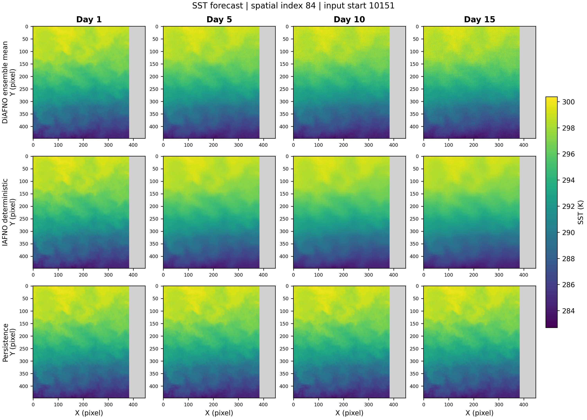

# 三种方法的 SST 预测对比

数据划分：test；配对样本数：200；DiAFNO 集合成员数：16。

DiAFNO 的 RMSE/MSE/MAE/bias/corr 使用集合均值；CRPS 使用完整经验集合分布。IAFNO 和 persistence 是点分布，因此 CRPS = MAE。

MSE skill = 1 − MSE / MSE(persistence)；CRPS skill = 1 − CRPS / CRPS(persistence)。正值表示优于 persistence，persistence 自身为 0（基线分母为 0 时未定义）。

overall 汇总全部 15 个预测日的有效像素，按像素数加权，不是只平均图中的四天，也不是对各天 RMSE 取平均。corr 为原始 SST 的 Pearson 相关系数，不是去气候态 ACC。

95% CI：按初始化时间作 22 日配对分块 bootstrap，2000 次重采样。空间样本与方法保持配对；少于两个时间块或关闭 bootstrap 时记为 —。少样本 CI 仅作探索性参考。

## Day +1

| forecast | RMSE (K) | MSE (K²) | MAE (K) | bias (K) | corr | CRPS (K) | MSE skill | MSE skill 95% CI | CRPS skill | CRPS skill 95% CI |
|---|---:|---:|---:|---:|---:|---:|---:|---|---:|---|
| DiAFNO | 0.2567 | 0.0659 | 0.1640 | -0.0148 | 0.9995 | 0.1322 | -0.9% | [-2.7%, +0.6%] | +14.2% | [+13.0%, +15.5%] |
| IAFNO | 0.2491 | 0.0620 | 0.1518 | 0.0014 | 0.9996 | 0.1518 | +5.0% | [+3.7%, +6.3%] | +1.5% | [+0.9%, +2.2%] |
| persistence | 0.2556 | 0.0653 | 0.1541 | -0.0014 | 0.9995 | 0.1541 | +0.0% | [+0.0%, +0.0%] | +0.0% | [+0.0%, +0.0%] |

## Day +5

| forecast | RMSE (K) | MSE (K²) | MAE (K) | bias (K) | corr | CRPS (K) | MSE skill | MSE skill 95% CI | CRPS skill | CRPS skill 95% CI |
|---|---:|---:|---:|---:|---:|---:|---:|---|---:|---|
| DiAFNO | 0.5596 | 0.3131 | 0.3908 | -0.0777 | 0.9978 | 0.3019 | +9.8% | [+5.8%, +13.3%] | +24.0% | [+22.4%, +25.6%] |
| IAFNO | 0.5369 | 0.2882 | 0.3660 | -0.0257 | 0.9979 | 0.3660 | +17.0% | [+13.3%, +20.3%] | +7.9% | [+6.0%, +9.7%] |
| persistence | 0.5892 | 0.3472 | 0.3975 | -0.0338 | 0.9975 | 0.3975 | +0.0% | [+0.0%, +0.0%] | +0.0% | [+0.0%, +0.0%] |

## Day +10

| forecast | RMSE (K) | MSE (K²) | MAE (K) | bias (K) | corr | CRPS (K) | MSE skill | MSE skill 95% CI | CRPS skill | CRPS skill 95% CI |
|---|---:|---:|---:|---:|---:|---:|---:|---|---:|---|
| DiAFNO | 0.7211 | 0.5200 | 0.5064 | -0.1055 | 0.9963 | 0.3903 | +16.1% | [+10.2%, +20.9%] | +27.2% | [+25.1%, +29.2%] |
| IAFNO | 0.6898 | 0.4758 | 0.4759 | -0.0329 | 0.9966 | 0.4759 | +23.3% | [+17.5%, +28.0%] | +11.2% | [+8.2%, +13.9%] |
| persistence | 0.7874 | 0.6200 | 0.5360 | -0.0430 | 0.9955 | 0.5360 | +0.0% | [+0.0%, +0.0%] | +0.0% | [+0.0%, +0.0%] |

## Day +15

| forecast | RMSE (K) | MSE (K²) | MAE (K) | bias (K) | corr | CRPS (K) | MSE skill | MSE skill 95% CI | CRPS skill | CRPS skill 95% CI |
|---|---:|---:|---:|---:|---:|---:|---:|---|---:|---|
| DiAFNO | 0.8658 | 0.7496 | 0.6023 | -0.1239 | 0.9947 | 0.4662 | +21.3% | [+13.6%, +27.1%] | +28.8% | [+25.8%, +31.6%] |
| IAFNO | 0.8271 | 0.6841 | 0.5653 | -0.0317 | 0.9951 | 0.5653 | +28.2% | [+20.3%, +34.0%] | +13.7% | [+9.6%, +17.3%] |
| persistence | 0.9759 | 0.9524 | 0.6547 | -0.0506 | 0.9931 | 0.6547 | +0.0% | [+0.0%, +0.0%] | +0.0% | [+0.0%, +0.0%] |

## Overall（Day 1–15）

| forecast | RMSE (K) | MSE (K²) | MAE (K) | bias (K) | corr | CRPS (K) | MSE skill | MSE skill 95% CI | CRPS skill | CRPS skill 95% CI |
|---|---:|---:|---:|---:|---:|---:|---:|---|---:|---|
| DiAFNO | 0.6553 | 0.4294 | 0.4413 | -0.0877 | 0.9970 | 0.3416 | +15.9% | [+10.0%, +20.4%] | +26.0% | [+24.0%, +27.9%] |
| IAFNO | 0.6272 | 0.3934 | 0.4138 | -0.0270 | 0.9972 | 0.4138 | +22.9% | [+17.4%, +27.3%] | +10.3% | [+7.7%, +12.8%] |
| persistence | 0.7144 | 0.5104 | 0.4614 | -0.0368 | 0.9963 | 0.4614 | +0.0% | [+0.0%, +0.0%] | +0.0% | [+0.0%, +0.0%] |

## 预测图

每张图固定一个区域与初始化时间，三行依次为 DiAFNO、IAFNO、persistence，四列为 Day 1/5/10/15。图中 DiAFNO 显示集合均值。所有图共享 SST 色标；灰色为对应预测日的无效目标像素。



测试集某区域的 Day 1/5/10/15 SST 预测对比

## 来源与复现

```json
{
  "created_beijing": "2026-09-05T13:41:26.270056+08:00",
  "split": "test",
  "sst_unit": "K",
  "sst_offset": 0.0,
  "ensemble_members": 16,
  "sampling_steps": 16,
  "seed": 123,
  "sample_indices": [
    167,
    351,
    651,
    839,
    1599,
    1645,
    1704,
    1784,
    2457,
    2768,
    3350,
    3596,
    5942,
    6390,
    7777,
    7898,
    8496,
    8538,
    8577,
    8859,
    10424,
    12780,
    14110,
    15225,
    15840,
    16369,
    16759,
    18323,
    18744,
    19184,
    19421,
    19487,
    19811,
    20356,
    20360,
    20906,
    21004,
    22298,
    22448,
    23528,
    23605,
    24097,
    24329,
    25291,
    25573,
    25611,
    26285,
    26637,
    27036,
    27049,
    27497,
    27665,
    28163,
    28374,
    28461,
    28978,
    29407,
    29611,
    30538,
    30696,
    31081,
    31279,
    32574,
    33081,
    33113,
    33477,
    33653,
    34555,
    35259,
    35844,
    36834,
    37220,
    37323,
    37746,
    38401,
    39965,
    40859,
    41320,
    41952,
    41967,
    42111,
    43743,
    43786,
    44949,
    45168,
    45231,
    45362,
    45880,
    45922,
    46932,
    47221,
    47442,
    47521,
    47862,
    48120,
    48349,
    48436,
    48622,
    49074,
    49627,
    49839,
    50039,
    51274,
    51748,
    51879,
    52038,
    52061,
    53683,
    53991,
    54176,
    54884,
    54978,
    55204,
    55603,
    56016,
    56643,
    56924,
    57226,
    57385,
    58090,
    58191,
    58227,
    58266,
    58691,
    58938,
    59987,
    60553,
    62189,
    62567,
    63639,
    63978,
    63984,
    64360,
    64438,
    64695,
    65463,
    67453,
    68132,
    68243,
    68925,
    69096,
    69565,
    71163,
    72465,
    73925,
    74503,
    75333,
    79805,
    80438,
    80726,
    81630,
    81880,
    82214,
    82240,
    83639,
    83866,
    84519,
    87092,
    87467,
    87706,
    88052,
    88253,
    88339,
    89634,
    89664,
    89774,
    89804,
    90254,
    90515,
    90823,
    91017,
    92220,
    92290,
    92696,
    92714,
    92971,
    94574,
    95171,
    95517,
    95586,
    95679,
    96036,
    96580,
    98251,
    98261,
    99273,
    100367,
    100936,
    101307,
    101459,
    101466,
    101950,
    102127,
    102417,
    103663,
    104504,
    104581,
    105097,
    105960,
    107323
  ],
  "plot_positions": [
    0,
    99,
    199
  ],
  "sampling": "fixed seed random subset; sorted indices; figures evenly spaced positions chosen before forecasts",
  "member_seed": "seed + dataset_index * 1000 + member_index; one sample per inference batch",
  "h5_path": "/data2/user/zzx/exam_preprocessed_data/ocean_temperature_data_patched.h5",
  "h5_size": 473372270419,
  "data_manifest": null,
  "data_manifest_sha256": null,
  "checkpoints": {
    "DiAFNO": {
      "path": "/data2/user/zzx/exam_preprocessed/DiAFNO/experiments/ostia_7day_to15day_residual_scratch/best_val_mean_rmse.pth",
      "sha256": "4d62f6c250aa4ebb19f68920398660b824bfe8963d3f39c969104a026be30291"
    },
    "IAFNO": {
      "path": "/data2/user/zzx/exam_preprocessed/DiAFNO/experiments/det_lead_standardized/epoch_015.pth",
      "sha256": "cb09b15ce97e11800b83fcf7c8ef9df09aa47f8831a0a36fffa987e413fc53e6"
    }
  },
  "block_days": 22,
  "bootstrap_replicates": 2000,
  "ci_confidence": 0.95,
  "crps_definition": "empirical ensemble CRPS (not fair CRPS); deterministic CRPS=MAE",
  "overall_definition": "all valid pixels over all 15 lead days",
  "s_churn": 0.0,
  "use_amp": true,
  "elapsed_seconds_inference_and_scores": 2075.80310999183,
  "seconds_per_sample_three_methods": 10.37901554995915,
  "case_selection_record": "case_selection.json",
  "aggregate_evaluation_source": "/data2/user/zzx/exam_preprocessed/DiAFNO_spatiotemporal_ablation/experiments/three_method_ep22_test200_e16_20260905"
}
```
